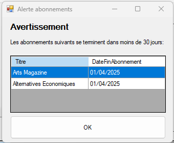
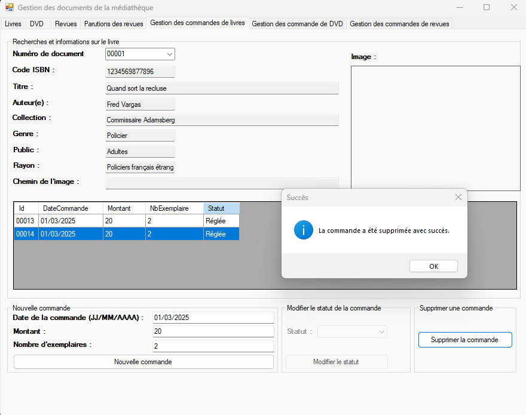

# MediatekDocuments
Cette application permet de gérer les documents (livres, DVD, revues) d'une médiathèque. Elle a été codée en C# sous Visual Studio 2022. C'est une application de bureau, prévue d'être installée sur plusieurs postes accédant à la même base de données. 
L'application exploite une API REST pour accéder à la BDD MySQL.

## Lien vers les dépôts d'origine
 Vous pouvez retrouver le dépôt d'origine de l'application C# en cliquant sur ce lien: https://github.com/CNED-SLAM/MediaTekDocuments .
 Vous pouvez retrouver le dépôt d'origine de l'API rest en cliquant sur ce lien: https://github.com/CNED-SLAM/rest_mediatekdocuments .
 Dans le readme de ces dépôts se trouvent l'application C# et l'API rest d'origine, ainsi que la présentation d'origine.

## Présentation des fonctionnalités ajoutées
 Dans cette partie, vous pourrez retrouver les fonctionnalités ajoutées à l'application.

### Fenêtre d'authentification
 Lorsque l'application est lancée, une fenêtre demande à l'utilisateur de s'authentifier.
 Son niveau de droit variera en fonction de son service: accès complet, partiel ou interdit à l'application.

### Fenêtre des abonnements se terminant dans les 30 prochains jours

 Si l'utilisateur a les permissions suffisantes (gestion), une fenêtre s'affiche au démarrage lui montrant la liste des abonnements se terminant dans les 30 prochains jours.
 Cette fenêtre ne s'affichera pas si aucun abonnement n'est dans cette situation.

### Fenêtre de gestion des livres

  Il est possible d'ajouter une nouvelle commande de livre une fois son numéro sélectionné, en précisant sa date de commande, son montant et son nombre d'exemplaires.

  Il est possible de modifier le statut d'une commande une fois son numéro sélectionné, en respectant l'ordre des étapes.
  En cours -> Livrée / Relancée
  Relancée -> Livrée / En cours
  Livrée -> Réglée
  Réglée: Etape finale
  Lorsqu'une commande passe à "Livrée", les exemplaires sont automatiquement ajoutés dans la base de données.

  Il est possible de supprimer une commande de livre une fois son numéro sélectionné, à condition que le statut de la commande ne soit pas à "Livrée".

### Fenêtre de gestion des dvds

  Il est possible d'ajouter une nouvelle commande de dvd une fois son numéro sélectionné, en précisant sa date de commande, son montant et son nombre d'exemplaires.

  Il est possible de modifier le statut d'une commande une fois son numéro sélectionné, en respectant l'ordre des étapes.
  En cours -> Livrée / Relancée
  Relancée -> Livrée / En cours
  Livrée -> Réglée
  Réglée: Etape finale
  Lorsqu'une commande passe à "Livrée", les exemplaires sont automatiquement ajoutés dans la base de données.

  Il est possible de supprimer une commande de dvd une fois son numéro sélectionné, à condition que le statut de la commande ne soit pas à "Livrée".

### Fenêtre de gestion des revues

  Il est possible d'ajouter une nouvelle commande de revue une fois son numéro sélectionné, en précisant sa date de commande, son montant et sa date d'expiration.

  Il est possible d'afficher la fenêtre des abonnements se terminant dans les 30 prochains jours.

  Il est possible de supprimer une commande de revue une fois son numéro sélectionné, à condition qu'aucun exemplaire n'est rattaché.

### Vidéo de présentation des fonctionnalités
 Pour plus d'informations, il est possible de consulter cette vidéo, montrant toutes les
fonctionnalités de la nouvelle application: https://youtu.be/d0FO9RWz3g0 .

### Documentations techniques
 Vous pourrez retrouver les documentations techniques de l'application C# et de l'API rest dans le dossier "documentations".
 Pour les consulter en local, lancez Wamp64 et placez les deux dossiers contenus dans le dossier "documentations" du dépôt dans votre dossier "C:/wamp64/www".
 Vous pourrez ainsi les consulter via les liens suivants: http://localhost/mediatekdocuments_doc (application C#) et http://localhost/rest_mediatekdocuments_doc (API rest).
 Vous pouvez aussi accéder aux documentations en ligne via les liens suivants: http://mediatekdocumentsugo.francecentral.cloudapp.azure.com/rest_mediatekdocuments_doc/ (application C#) et http://mediatekdocumentsugo.francecentral.cloudapp.azure.com/mediatekdocuments_doc/html/85d46cf5-bf55-169b-05a9-fbd4084b4f5d.htm (API rest).

### Installer l'application
 Pour installer l'application, rendez-vous dans le dossier "installateurs".
 Si vous voulez tester l'application en local, ouvrez le setup "MediaTekDocumentsInstalleurLocal", et suivez les étapes pour procéder à l'installation.
 Si vous voulez tester l'application en ligne, ouvrez le setup "MediaTekDocumentsInstalleurOnline", et suivez les étapes pour procéder à l'installation.
 Dans le cas où vous avez choisi l'application en ligne, l'application sera directement prête à être utilisée: un raccourci sur le bureau a normalement été créé, et l'application doit normalement apparaître dans la liste des programmes. Vous n'avez plus qu'à exécuter l'application, et à vous authentifier.
 Dans le cas où vous avez choisi l'application en local, l'application sera installée: un raccourci sur le bureau a normalement été créé, et l'application doit normalement apparaître dans la liste des programmes. Cependant, l'API rest et la base de données n'ont pas encore été installés. Suivez donc les étapes suivants pour pouvoir installer l'API rest et la base de données en local.
 1) Téléchargez l'API rest via ce lien: https://github.com/Jalab123/rest_mediatekdocuments.
 2) Renommer le dossier "rest_mediatekdocuments", placez-le dans votre dossier "C:/wamp64/www" et lancez Wamp64.
 3) Ouvrez une console en mode administrateur, dirigez vous dans le dossier de l'API rest avec la commande "C:/wamp64/www", et exécutez la commande "composer install".
 4) Connectez-vous à PhpMyAdmin via ce lien: http://localhost/phpmyadmin .
 5) Créez une nouvelle base de données "mediatek86".
 6) Allez dans "Importer" et sélectionnez le fichier "mediatek86.sql", puis exécutez.
 7) L'API rest et la base de données ont été correctement mis en place. Vous n'avez plus qu'à lancer l'application, et à vous authentifier. Adaptez les informations contenues dans le ".env" de l'API rest si besoin (notamment si votre utilisateur de base de données est différent).
